# Bienvenue à JMap Survey

JMap Survey est une application mobile de la famille des applications JMap (JMap Pro, JMap Web et JMap Survey) qui fonctionne sur des téléphones intelligents et tablettes iOS et Android.

Elle permet notamment l'affichage de données vectorielles et matricielles d'un projet JMap, l'interrogation des données et l'édition de données vectorielles, autant en mode connecté que déconnecté. Ces caractéristiques la rend appropriée pour la saisie des données sur le terrain lors de la réalisation de travaux tels que les inventaires d'arbres, les inspections de bâtiments et d'infrastructures ou le suivi de l'avancement de projets octroyés en sous-traitance.

# Travailler avec un appareil iOS

## Installer JMap Survey

Pour installer JMap Survey sur votre appareil iOS :

1. Téléchargez JMap Survey à partir de l'App Store en touchant **Installer** : https://itunes.apple.com/ca/app/jmap-survey/id1440073003?l=fr&mt=8.

2. Touchez l'icône  pour ouvrir JMap Survey. L'application s'affiche en anglais ou en français, en fonction de la langue sélectionnée dans votre appareil mobile.

3. Autorisez les fonctions de géolocalisation de votre appareil. Votre réponse est mémorisée.

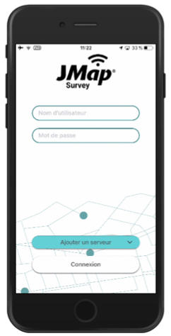

## Se connecter à un projet JMap

JMap Survey se connecte directement aux projets JMap. Pour configurer la première connexion à un projet :

1. Dans l'écran d'accueil, touchez **Ajouter un serveur**. La fenêtre **Ajouter un nouveau** s'ouvre automatiquement pour créer la connexion à un projet.

3. Inscrivez le nom du projet et l'URL principale du serveur JMap. Le nom du projet et l'URL ne sont pas sensibles à la casse. Ces informations vous sont fournies par votre administrateur JMap.
  
   Exemple d'URL : [https://jmap7.jmaponline.net](https://jmap7.jmaponline.net/) (avec port si différent de 80, ex. :8080 )
   
   Exemple de nom du projet : Montreal
   
3. Touchez **Créer**. L'accès au projet est configuré et le nom du projet s'affiche désormais sur l'écran d'accueil. 

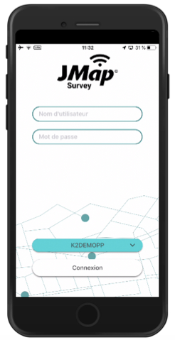

Vous pouvez vous connecter à d'autres projets à partir de l'écran **Sélectionnez le serveur** :

1. Dans l'écran d'accueil, touchez le nom du projet pour accéder à l'écran **Sélectionnez le serveur**.
2. Touchez  **Ajouter un serveur** pour ouvrir la fenêtre **Ajouter un nouveau** et configurer l'accès à un nouveau projet.

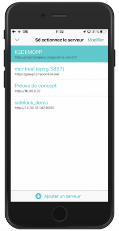

## Modifier les connexions aux projets JMap

Vous pouvez modifier ou effacer les informations de connexion d'un projet à partir de l'écran **Sélectionnez le serveur** :

1. Touchez le nom du projet à l'accueil de JMap Survey pour accéder à l'écran **Sélectionnez le serveur**.
2. Glissez un projet à gauche pour le modifier ou l'effacer.

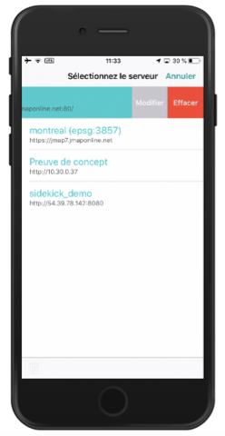

3. Touchez **Modifier** pour ouvrir la fenêtre **Modifier** dans laquelle effectuer les changements dans le nom du projet et/ou l'URL du serveur.

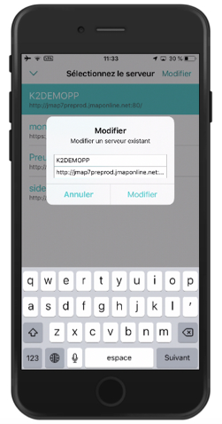

Pour effacer les informations de connexion de plusieurs projets au même temps :

1. Dans l'écran **Sélectionnez le serveur**, touchez **Modifier**.
2. Cochez la case des projets que vous souhaitez effacer.

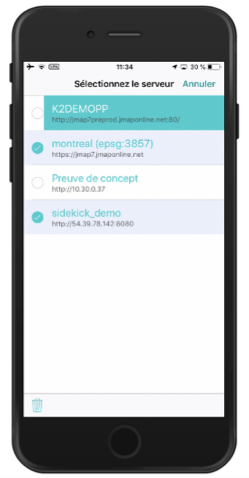

3. Touchez l'icône  pour effacer les projets ou **Annuler** pour revenir à l'écran **Sélectionnez les projets**.
4. Touchez  pour retourner à l'écran d'accueil de JMap Survey.

# Travailler avec un appareil Android

## Installer JMap Survey

Pour installer JMap Survey sur votre appareil Android :

1. Téléchargez JMap Survey à partir du Google Play Store en touchant **Installer** : https://play.google.com/store/apps/details?id=com.k2geospatial.jmap.
2. Touchez l'icône  pour ouvrir JMap Survey. L'application s'affiche en anglais ou en français, en fonction de la langue sélectionnée dans votre appareil mobile.

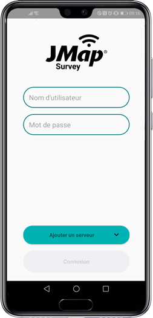

3. Autorisez les fonctions de géolocalisation et l'accès aux photos, caméra et fichiers de votre appareil. Votre réponse est mémorisée.

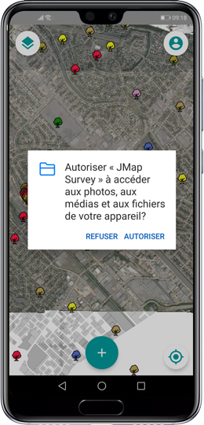

## Se connecter à un projet JMap

Pour configurer la première connexion à un projet sur votre appareil Android :

1. Dans l'écran d'accueil, touchez **Ajouter un serveur** . La fenêtre **Ajouter un nouveau** s'ouvre automatiquement pour créer la connexion à un projet.

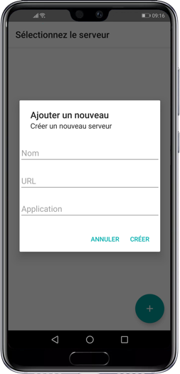

2. Donnez un nom à votre projet dans JMap Survey.
3. Inscrivez l'URL principale du serveur JMap et le nom du projet JMap auquel vous vous connectez. Le nom du projet et l'URL ne sont pas sensibles à la casse. Ces informations vous sont fournies par votre administrateur JMap.
   Exemple d'URL : [https://jmap7.jmaponline.net](https://jmap7.jmaponline.net/) (avec port si différent de 80, ex. :8080 )
   Exemple de nom du projet : Montreal
4. Touchez **Créer**. L'accès au projet est configuré et le nom du projet s'affiche désormais sur l'écran d'accueil. 

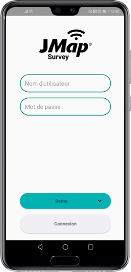

Vous pouvez vous connecter à d'autres projets à partir de l'écran **Sélectionnez le serveur** :

1. Dans l'écran d'accueil, touchez le nom du projet pour accéder à l'écran **Sélectionnez le serveur**.
2. Touchez  pour ouvrir la fenêtre **Ajouter un nouveau** et configurer l'accès à un nouveau projet.

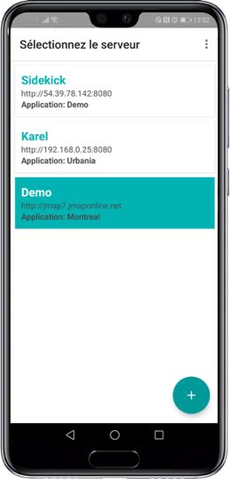

## Modifier les connexions aux projets

Vous pouvez modifier ou effacer les informations de connexion d'un projet à partir de l'écran **Sélectionnez le serveur** :

1. Touchez le nom du projet à l'accueil de JMap Survey pour accéder à l'écran **Sélectionnez le serveur**.
2. Touchez 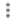 pour afficher la fonction **Sélectionner items**.
3. Sélectionnez le projet de votre choix.

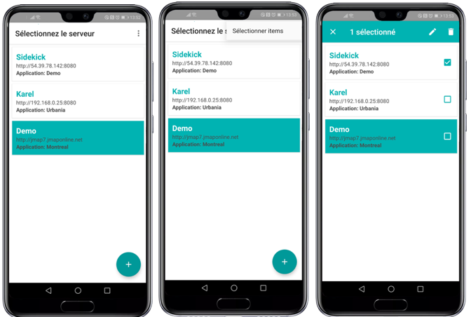

4. Touchez  pour ouvrir la fenêtre **Modifier** dans laquelle effectuer les changements dans les noms de projet et/ou l'URL du serveur.

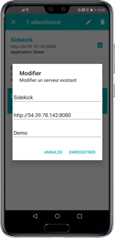

5. Touchez  pour effacer le projet. 
6. Sélectionnez plusieurs projets. Seule la fonction effacer est disponible.

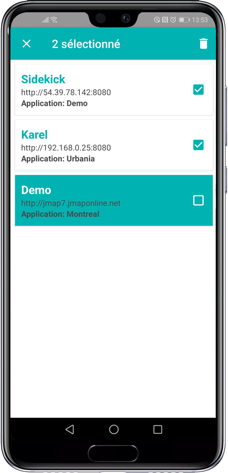

7. Touchez l'icône pour effacer les projets ou  pour annuler la sélection et revenir à l'écran **Sélectionnez les projets**.

# Ouvrir une session

Votre administrateur JMap vous fournira votre nom d'utilisateur et un mot de passe pour ouvrir une session JMap Survey.

Dans l'écran d'accueil :

1. Inscrivez le nom d'**Utilisateur**.
2. Inscrivez le **Mot de passe**. Celui-ci est sensible à la casse. Vous pouvez sauvegarder votre nom d'utilisateur et votre mot de passe sur un appareil Android.

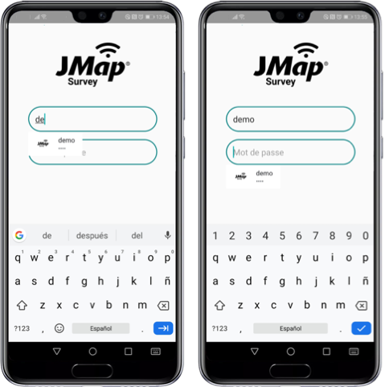

3. Sélectionnez le projet auquel vous connecter. Si vous avez configuré la connexion à plusieurs projets, touchez la liste pour ouvrir l'écran **Sélectionnez le serveur** et afficher la liste des projets.

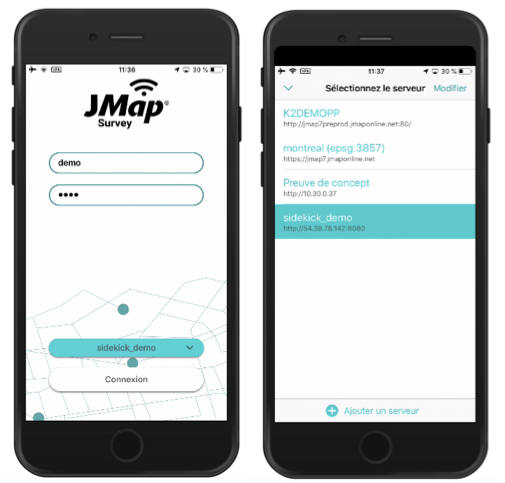

4. Sélectionnez le projet que vous souhaitez ouvrir.
5. Touchez **Connexion** pour ouvrir le projet. La carte s'affiche.

# L'interface graphique

L'interface graphique est épurée et laisse toute la place à l'affichage des données cartographiques. 

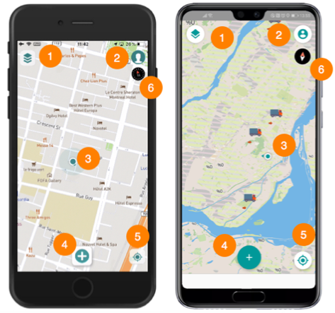

|  |  |
| ----- | ------------------------------------------------------------ |
| **1** | [Couches](https://doc.k2geospatial.com/jmap/doc/7.0/app/survey/fr/donnees_de_lapplication.htm). Touchez pour ouvrir le menu des couches de données du projet.  |
| **2** | [Compte](https://doc.k2geospatial.com/jmap/doc/7.0/app/survey/fr/travaillerenmodedeconnecte.htm). Touchez pour ouvrir cette section qui concerne le travail en mode hors-ligne et la fermeture de session. |
| **3** | Localisation de votre appareil mobile représentée sur la carte. |
| **4** | [Créer un objet](https://doc.k2geospatial.com/jmap/doc/7.0/app/survey/fr/editer_des_donnees.htm). Touchez pour afficher la liste des objets que vous êtes autorisé à créer (selon les couches éditables du projet et leurs permissions). |
| **5** | **Géolocalisation**. Touchez pour centrer la carte sur le point où vous êtes localisé (coordonnées géographiques de votre appareil mobile). |
| **6** | La boussole indique la rotation de la carte. Touchez la boussole pour annuler la rotation. |

# Afficher une carte

Les données contenues dans le projet sont organisées en couches. Vous pouvez sélectionner les couches que vous souhaitez utiliser comme carte de base et celles que vous souhaitez afficher ou masquer. L'ensemble de couches sélectionnées constitue la carte qui s'affiche dans l'application.

JMap Survey affiche les couches avec leur style. Si la couche contient des thématiques, la thématique sélectionnée pour s'afficher par défaut à l'ouverture du projet s'affiche en JMap Survey. La légende de la thématique ne s'affiche pas et vous ne pouvez pas changer la thématique affichée.

Pour sélectionner les couches à afficher :

1. Touchez  pour ouvrir le menu **Couches**.

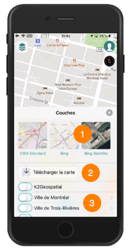

|  |  |
| ----- | ------------------------------------------------------------ |
| **1** | Miniatures des cartes de base. Touchez la miniature de votre choix pour l'afficher ou la masquer. |
| **2** | Outil pour télécharger la carte sur votre appareil mobile, en préparation du travail en mode déconnecté. La section [Travailler en mode déconnecté](https://doc.k2geospatial.com/jmap/doc/7.0/app/survey/fr/travaillerenmodedeconnecte.htm) offre des détails sur le sujet. |
| **3** | Liste des couches du projet que vous pouvez afficher ou masquer au besoin. |

2. Sélectionnez la carte de base. Vous pouvez afficher une seule carte de base à la fois.
3. Utilisez les interrupteurs ** pour sélectionner les couches que vous souhaitez afficher ou masquer.

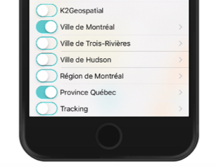

4. La flèche  indique un groupe qui contient plusieurs couches. Touchez la flèche pour afficher les couches et/ou les sous-groupes qui composent le groupe. Vous devez activer les boutons de chaque groupe dans lequel se trouve la couche pour qu'elle s'affiche. Si vous masquez le groupe aucune des couches qu'il contient ne s'affiche.
   Certaines couches peuvent être configurées pour s'afficher dans des intervalles d'échelles précises. Il se peut qu'elles ne s'affichent pas à l'échelle actuelle de la carte. Vous pouvez agrandir la carte (zoom avant) pour les afficher.
5. Touchez  ou touchez la carte pour fermer le menu **Couches**. 

# Accéder aux informations associées à un objet

Certaines couches ont des informations descriptives associées aux éléments ou objets de la couche. Les informations s'affichent dans des interfaces appelées **infobulles**. De plus, si l'extension **Documents** est détectée sur le serveur JMap et que vous avez les permissions requises, un bouton dans l'infobulle vous permet d'accéder aux documents associés à l'objet. Vous pouvez ouvrir et consulter les documents directement sur l'appareil mobile.

Pour afficher les infobulles : 

1. Touchez un élément d'une couche dont vous souhaitez afficher l'infobulle. Celle-ci peut contenir des données descriptives, des hyperliens à des sites web, à des documents divers ou des photos.

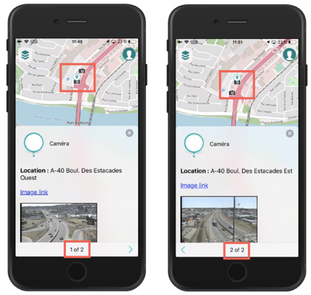

En fonction de l'échelle, à partir de l'infobulle d'un objet que vous touchez vous pouvez afficher les infobulles d'autres objets qui se trouvent à proximité en touchant les flèches  et **. Dans la figure ci-haut, l'infobulle indique que vous pouvez afficher l'infobulle d'une deuxième caméra située à proximité. Un marqueur indique sur la carte l'objet dont l'infobulle est affichée.
2. Touchez l'hyperlien pour ouvrir la photo, le document ou le site web. 

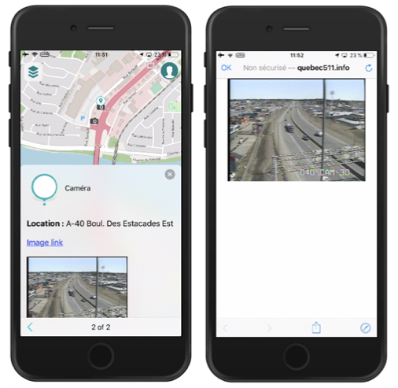

La figure affiche le site web ouvert à partir de l'hyperlien *Image link* des infobulles des caméras.Les extensions de partage de l'appareil mobile ainsi que d'autres fonctions sont disponibles pour partager ou rafraîchir les informations.
3. Touchez  pour fermer l'infobulle.

Pour accéder aux documents associés à un objet :

1. Ouvrez l'infobulle de l'objet pour lequel vous souhaitez accéder aux documents associés.
2. Touchez l'icône 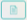 pour accéder à **Documents**. Si l'icône ne s'affiche pas et vous savez que l'extension **Documents** est installée sur le serveur et vous avez les permissions pour y accéder, il n'y a pas des documents associés à l'objet. S'il y en a ceux-ci s'affichent sous forme de vignettes.
3. Touchez une vignette pour accéder à un document. L'application ou la page web correspondante (Google Drive, Word, Excel, etc.) s'ouvre pour afficher le document. Vous pouvez utiliser les extensions de partage d'iOS ou d'Android.

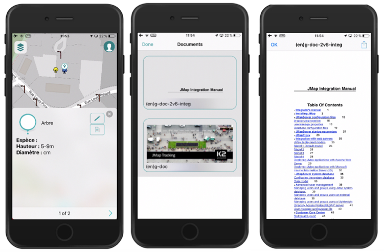

4. Touchez **OK** pour retourner à l'infobulle.
5. Touchez  pour fermer l'infobulle.

# Créer des objets

JMap Survey permet de créer des objets en mode connecté ou déconnecté.

Pour créer un objet :

1. Touchez  pour afficher les types d'objets disponibles. Des icônes  avec des légendes s'affichent. Les types d'objets disponibles dépendent des couches éditables du projet et de vos permissions d'édition. JMap Survey affiche les types d'objets disponibles pour lesquels vous avez des droits d'édition.

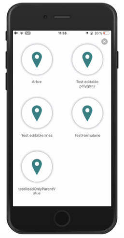

2. Sélectionnez le type d'objet en touchant l'icône correspondante. L'écran pour localiser l'objet s'affiche. 

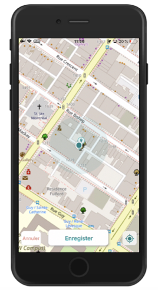

3. Si l'objet est ponctuel, il est automatiquement placé à votre position actuelle. Vous pouvez modifier la localisation en touchant la carte. L'objet se positionne sur le point que vous touchez. Touchez  pour ramener l'objet ponctuel à votre position courante.
4. Si l’objet est polygonal ou linéaire, touchez la carte pour placer chaque point du polygone ou de la ligne. Chaque point a un numéro. 
5. Touchez **Enregistrer** pour confirmer la saisie de l’objet ou **Annuler** pour l'effacer. Si vous confirmez la saisie de l'objet, le formulaire pour la saisie des attributs de l'objet s'affiche.

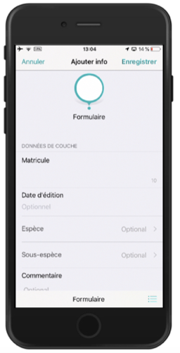

6. Saisissez les informations des champs du formulaire. Certains champs sont obligatoires (vous ne pouvez pas enregistrer le formulaire si le champ n'a pas une valeur) et d'autres sont optionnels. Ceux-ci sont identifiés avec le texte *Optionnel*. 
Les champs pour lesquels vous devez choisir une ou plusieurs valeurs d'une liste déroulante sont indiqués avec la flèche . Touchez la flèche pour afficher les valeurs disponibles et effectuer votre sélection.
Les champs de type texte indiquent le nombre maximal de caractères du texte et le chiffre change à mesure que vous saisissez le texte, indiquant les caractères encore disponibles.
Les champs de type numérique indiquent les valeurs minimale et maximale autorisées. Si vous essayez d'inscrire du texte, celui-ci ne s'insère pas.
Les champs de type date affichent le calendrier lorsque vous les touchez.
7. Touchez 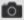 pour ajouter une photo au formulaire. Trois choix s'offrent à vous : **Prendre une photo**, utiliser une photo de la **Photothèque** ou **Annuler l'ajout de la photo**.
8. Sélectionnez **Prendre une photo**. JMap Survey vous demande la permission d'utiliser l'appareil photo de votre appareil. Cette autorisation vous est demandée une seule fois et demeure mémorisée.
9. Prenez la photo et validez-la ou reprenez une autre photo. La photo apparaît dans le formulaire.
10. Sélectionnez **Photothèque** pour accéder à votre photothèque et sélectionner une ou plusieurs photos. Elles sont ajoutées au formulaire.
11. Votre formulaire peut contenir des sous-formulaires pour la saisie des données à différents moments dans le temps ou dans des contextes différents. Dans ce cas, touchez le champ des sous-formulaires pour accéder à l'écran des sous-formulaires.
12. Touchez  pour ajouter un sous-formulaire. Celui-ci comporte des champs semblables à ceux du formulaire.
13. Saisissez les informations et les photos.
14. Touchez **OK** pour enregistrer le sous-formulaire. Celui-ci se ferme. Le champ **Sous-formulaires** indique le nombre de sous-formulaires associés au formulaire. Le chiffre indique les sous-formulaires créés par tous les utilisateurs du projet.
15. Touchez **Enregistrer** pour sauvegarder les informations du formulaire ou **Annuler** pour effacer les informations.
16. Touchez 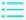 pour afficher les formulaires disponibles pour le type d'objet. Plusieurs formulaires peuvent être disponibles pour chaque type d'objets.

# Modifier des objets

Lorsque vous disposez des permissions requises, vous pouvez modifier les objets des couches éditables du projet. Veuillez suivre la procédure suivante :

1. Touchez  pour afficher les couches du projet.
2. Sélectionnez la couche à modifier pour vous assurer qu'elle est visible sur la carte.
3. Touchez l'objet à modifier pour afficher son infobulle.
4. Touchez  pour ouvrir l'interface de modification. 

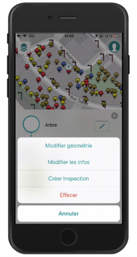

5. Sélectionnez **Modifier géométrie** pour modifier la géométrie et/ou la localisation de l'objet. 
6. Dans le cas d'un objet ponctuel, touchez la carte pour indiquer la nouvelle localisation, un marqueur indique la place choisie. Vous pouvez aussi toucher  pour amener l'objet à votre emplacement actuel.

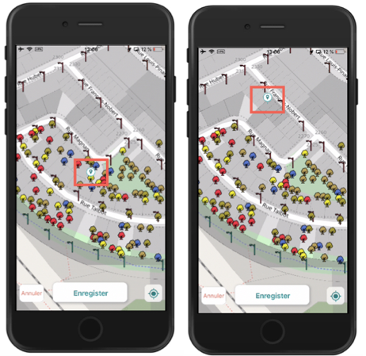

7. Touchez **Enregistrer** pour sauvegarder le changement ou **Annuler** pour le laisser sans effet.
8. Touchez **Modifier les infos** pour modifier les informations sur les attributs. Le formulaire s'ouvre et vous pouvez modifier les champs éditables ainsi que les sous-formulaires.

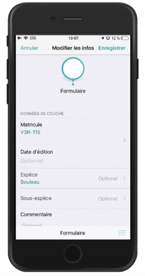

9. Des raccourcis aux sous-formulaires s'affichent par la suite dans l'interface de modification. Ceux-ci permettent d'accéder directement aux sous-formulaires pour les remplir. Dans l'exemple de la figure, un sous-formulaire *Inspection* existe et son raccourci s'appelle **Créer inspection.** Touchez **Créer inspection** pour créer un sous-formulaire associé au formulaire d'attributs de l'objet.

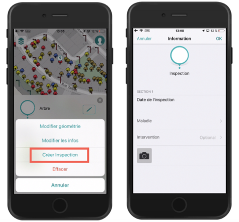

10. Touchez **Enregistrer** pour sauvegarder les modifications des sous-formulaires et du formulaire.
11. Touchez **Effacer** pour éliminer l'objet. Si vous avez la permission, l'objet est éliminé.

# Travailler en mode déconnecté

Le travail en mode déconnecté vous permet notamment de créer et de modifier des objets sur le terrain en absence d'une connexion à un réseau. Il implique les étapes suivantes :

1. Télécharger la carte pour un secteur donné.
2. Activer le mode déconnecté de JMap Survey (ou le mode avion de l'appareil). 
3. Saisir les données sur le terrain.
4. Lorsque la connexion à un réseau est disponible, désactiver le mode déconnecté (ou le mode avion de l'appareil).
5. Synchroniser les données (automatique).

## Télécharger la carte

Lorsque vous souhaitez utiliser JMap Survey en mode déconnecté, la première étape consiste à télécharger la carte sur votre appareil mobile pour qu'elle soit disponible en tant que référence spatiale. Pour ce faire :

1. Touchez  pour ouvrir le menu **Couches**.
2. Sélectionnez la carte de base à afficher dans la carte utilisant la procédure détaillée à la section [Afficher une carte](https://doc.k2geospatial.com/jmap/doc/7.0/app/survey/fr/donnees_de_lapplication.htm).
3. Touchez **Télécharger la carte**. Un cadre s'affiche pour sélectionner le périmètre de la carte.

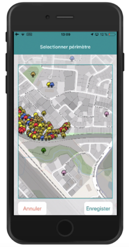

4. Déterminez le secteur et l'échelle de la carte à télécharger, en glissant la carte et en effectuant des zoom.
5. Touchez **Enregistrer** pour sauvegarder tous les éléments de la carte dans la mémoire de l'appareil. Les données de toutes les couches matricielles et vectorielles sont sauvegardées pour le secteur sélectionné.
6. Touchez **Annuler** pour annuler la procédure. Vous retournez à la carte.

Vous devez télécharger la carte à chaque fois que vous allez travailler en mode déconnecté pour qu'elle soit à jour, suite à la dernière synchronisation.

## Activer le mode déconnecté

Pour pouvoir activer le mode déconnecté, vous devez au préalable télécharger la carte. Pour activer le mode hors-ligne :

1. Touchez  pour accéder à l'écran **Compte**.
2. Activez le **Mode hors-ligne**.

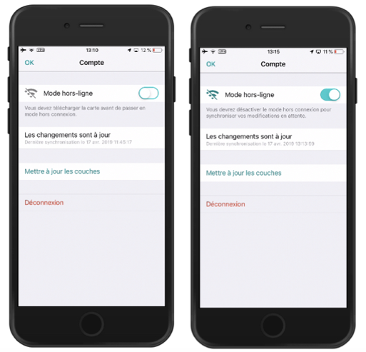

3. Touchez **OK** pour retourner à la carte. L'icône **Mode hors-ligne** s'y affiche.

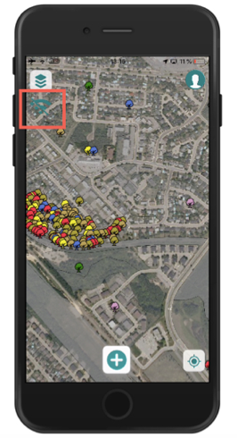

## Créer ou modifier des objets en mode déconnecté

Vous pouvez créer ou modifier des objets présents sur la carte que vous avez téléchargée au préalable. Les données sont sauvegardées dans l'appareil mobile.

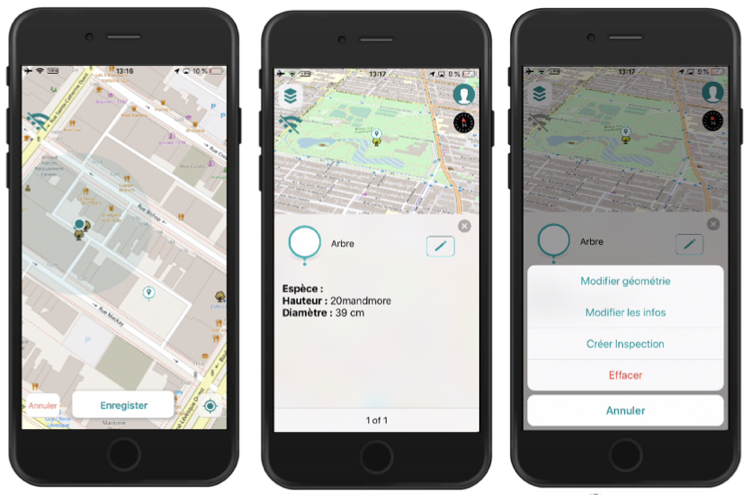

## Synchroniser les données

Une fois des données collectées sur le terrain en mode déconnecté vous devez synchroniser les données de votre appareil avec celles du serveur JMap :

1. Lorsque vous disposez d'une connexion à un réseau, désactivez le **Mode hors-ligne** dans l'écran **Compte**.
2. La synchronisation des modifications que vous avez effectuées se fait automatiquement.

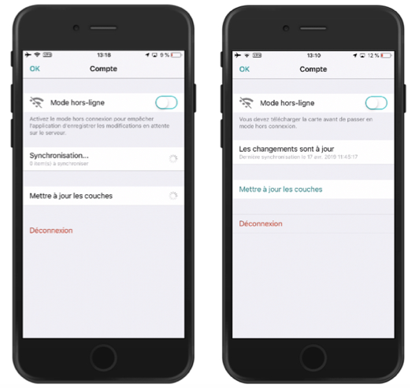

3. Touchez **OK** pour retourner à la carte.

# Fermer une session

Il n’est pas nécessaire de fermer la session JMap Survey, sauf si vous avez complètement terminé votre travail ou devez remettre l’appareil mobile à un collègue. Quand l’application est mise en veille ou volontairement terminée, votre session n’est pas fermée et toutes les données sont conservées et vous pouvez reprendre votre travail sans problème. Il est possible que JMap Survey vous demande de vous authentifier à nouveau lorsque vous retournez à l’application.

En fermant la session, par contre, toutes les données (cartes téléchargées et transactions non synchronisées) sont effacées. Si vous avez des transactions non synchronisées, JMap Survey vous demandera de confirmer votre choix avant de vous déconnecter et d’effacer les données.

Pour fermer la session JMap Survey procédez comme suit :

1. Touchez  pour accéder à l'écran  **Compte**.
2. Touchez **Déconnexion**. La session se ferme et vous retournez à l'écran d'accueil de JMap Survey.

